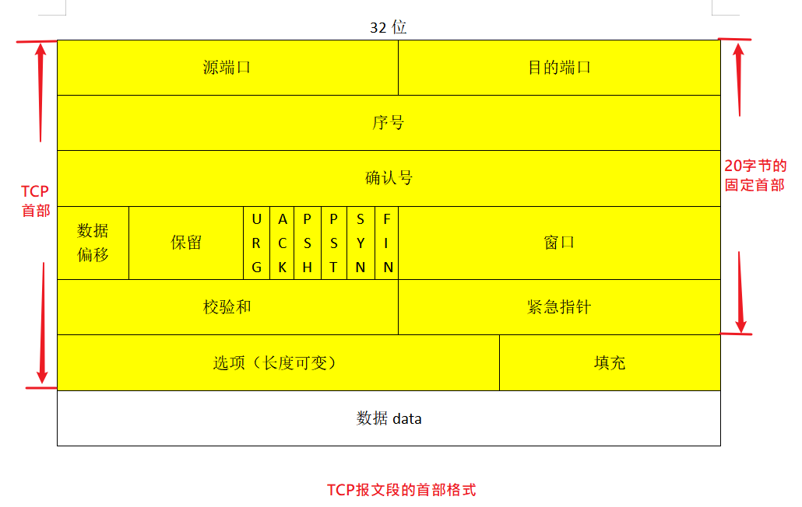
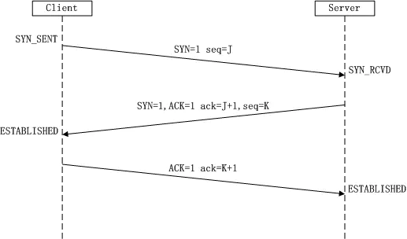
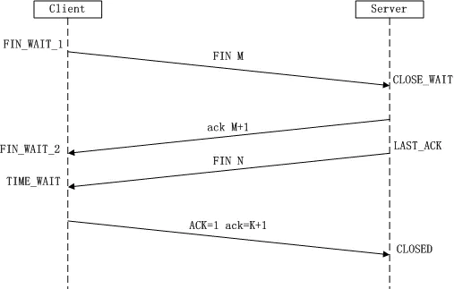

# TCP（传输控制协议）

## TCP的特点
### 1、TCP是面向连接的运输层协议
### 2、每个TCP连接都有两个端点，即点对点
### 3、TCP提供可靠交付，即可靠连接
### 4、TCP提供全双工通信。
### 5、TCP面向字节流

## TCP报文段的首部格式

首部的固定格式各字段的意义如下：
### 1、源端口和目的端口
各占2个字节，分别写入源端口号和目的端口号。
### 2、序号
占4个字节，TCP是面向字节流的，在一个TCP连接中传送的字节流中的每一个字节都按顺序编号。
### 3、确认号
占4个字节，是期望收到对方下一个报文段的第一个数据字节的序号，
### 4、数据偏移
占4个字节，他指出TCP报文段的数据起始处距离TCP报文段的起始处有多远。实际上就是指出TCP报文段的首部长度。
### 5、保留
占6个字节，保留为今后使用，但目前应该置为0。
### 6、
紧急URG：紧急标志。当URG=1时候，表明紧急指针字段有效。它告诉系统此报文段中由紧急数据，应尽快传送。相当于高优先级的数据。
于是发送方就将紧急数据插入到本报文段数据的最前面，与首部的紧急指针字段配合使用

确认ACK：确认标志。当ACK=1时，确认号字段有效，当ACK=0时，确认号无效。TCP规定，在连接建立后所有传送的报文段都必须把ACK置1。

推送PSH：推标志。当PSH=1时，表示接收端京可能将数据交付接收应用进程，即推送向前。

复位RST：复位标志。当RST=1时，表示复位TCP连接。

同步SYN：同步标志。在连接建立时用来同步序号，当SYN=1而ACK=0的时候，标志这是一个连接请求报文段。对方若同意连接，则在响应的报文段中
使SYN=1,ACK=1，因此，SYN置1就表示这是一个连接请求或连接接收报文。

终止FIN：终止标志。用来释放一个连接，当FIN=1时，表示此报文段的发送方的数据已经发送完毕，并要求释放运输连接。

### 7、窗口
占2个字节，窗口指的是发送本报文段的一方的接收窗口。窗口值作为接受方让发送方设置其发送窗口的依据。表示允许对方发送的数据量。
### 8、检验和
占2个字节，检验和字段检验的方位包括首部和数据两部分。
### 9、紧急指针
占2个字节，紧急指针仅在URG=1时才有意义，它指出本报文段中紧急数据的字节数。
### 10、选项
长度可变，最长可达40字节。当没有使用“选项”的时候，TCP首部长度是20字节。
### 11、填充
填充字段仅仅是为了使整个TCP首部长度使4字节的整数倍。
### 12、数据
即该报文携带的数据。

## TCP三次握手 ！！！（很重要的）

所谓三次握手也就是建立TCP连接，在建立一个TCP连接的时候，需要客户端和服务器端总共发送3个包以确认连接的建立。

第一次握手，Client将标志位SYN置为1，随机产生一个值seq=J，并将该数据包发送给Server,Client进入SYN_SENT状态，等待Server确认。

第二次握手，Server收到数据包后由标志位SYN=1知道Client请求建立连接，Server将标志位SYN和ACK都置为1，ACK=J+1,随机产生一个值seq=K,并将
该数据包发送给Client以确认连接请求，Server进入SYN_RCVD状态。

第三次握手，Client收到确认后，检查ack是否为J+1，ACK是否为1，如果正确则将标志位ACK置为1，ack=K+1，并将该数据包发送给Server，
Server检查ack是否为K+1，ACK是否为1，如果正确则连接建立成功，Client和Server进入ESTABLISHED状态，完成三次握手，随后Client与Server之间可以开始传输数据了。

## TCP四次挥手 ！！！（很重要）

所谓四次挥手也就是断开TCP连接，在断开一个TCP连接的时候，需要客户端和服务器端总共发送4个包以确认连接的断开。

由于TCP连接时全双工的，因此，每个方向都必须要单独进行关闭，这一原则是当一方完成数据发送任务后，发送一个FIN来终止这一方向的连接，
收到一个FIN只是意味着这一方向上没有数据流动了，即不会再收到数据了，但是在这个TCP连接上仍然能够发送数据，直到这一方向也发送了FIN。
首先进行关闭的一方将执行主动关闭，而另一方则执行被动关闭，上图描述的即是如此。

第一次挥手，Client发送一个FIN，用来关闭Client到Server的数据传送，Client进入FIN_WAIT_1状态。

第二次挥手，Server收到FIN之后，发送一个ACK给Client，确认序号为收到序号+1（与SYN相同，一个FIN占用一个序号），Server进入CLOSE_WAIT状态
 
第三次挥手，Server发送一个FIN，用来关闭Server到Client的数据传送，Server进入LAST_ACK状态。

第四次挥手，Client收到FIN后，Client进入TIME_WAIT状态，接着发送一个ACK给Server，确认序号为收到序号+1，Server进入CLOSED状态，完成四次挥手。

### 为什么建立连接是三次握手，而关闭连接却是四次挥手呢？（分开发送ACK和FIN）
这是因为服务端在LISTEN状态下，收到建立连接请求的SYN报文后，把ACK和SYN放在一个报文里发送给客户端。
而关闭连接时，当收到对方的FIN报文时，仅仅表示对方不再发送数据了但是还能接收数据，己方也未必全部数据都发送给对方了，
所以己方可以立即close，也可以发送一些数据给对方后，再发送FIN报文给对方来表示同意现在关闭连接，因此，己方ACK和FIN一般都会分开发送。

参考资料：
TCP协议详解 https://www.jianshu.com/p/ef892323e68f
以及谢希仁编著的《计算机网络》
