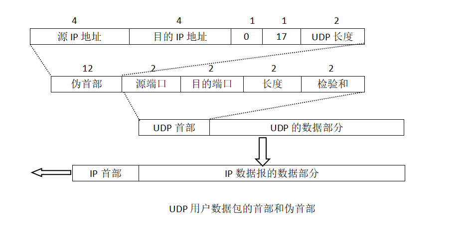
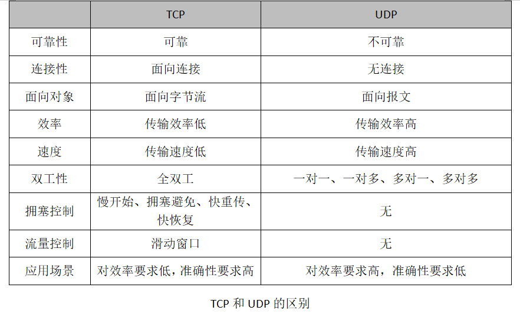

# UDP（用户数据报协议）

## UDP的特点
### 1、UDP是**无连接的**，即发送数据之前不需要建立连接，因此减少了开销和发送数据之前的时延。
### 2、UDP使用尽最大努力交付，即不保证可靠交付，因此主机不需要维持复杂的连接状态表。
### 3、UDP是面向报文的。发送方的UDP对应用程序交下来的，在添加首部后就向下交付IP层。
### 4、UDP没有拥塞控制，因此网络出现的拥塞不会使源主机的发送速率降低。
### 5、UDP支持一对一、一对多、多对一和多对多的交互通信。
### 6、UDP的首部开销小，只有8个字节，比TCP的20个字节的首部要短。

## UDP的首部格式

### 1、源端口
源端口号。在需要对方回信的时候选用，不需要时可置为全0。
### 2、目的端口
目的端口号。这在终点交付报文时必须使用。
### 3、长度
UDP用户数据报的长度，其最小值时8（仅有首部）。
### 4、检验和
检测UDP用户数据报在传输中是否有错。有错就丢弃。

## UDP检验和
UDP首部中检验和的计算方法有些特殊。在计算检验和的时候，要在UDP用户数据包之前添加12个字节的伪首部。注意，这个伪首部只是临时添加在UDP用户数据报前面，
伪首部既不向下传送也不想上递交，而仅仅是为了计算检验和。

UDP计算检验和的方法和计算IP数据报首部检验和的方法相似，但不同的是，IP数据包的检验和只检验IP数据包的首部，但UDP的检验和是**把首部和数据部分一起都检验**。

## TCP和UDP的区别
